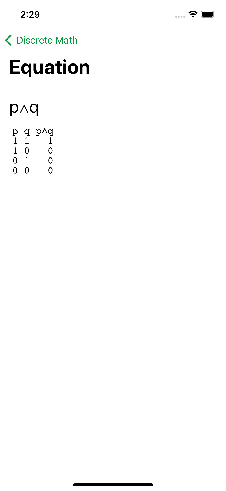
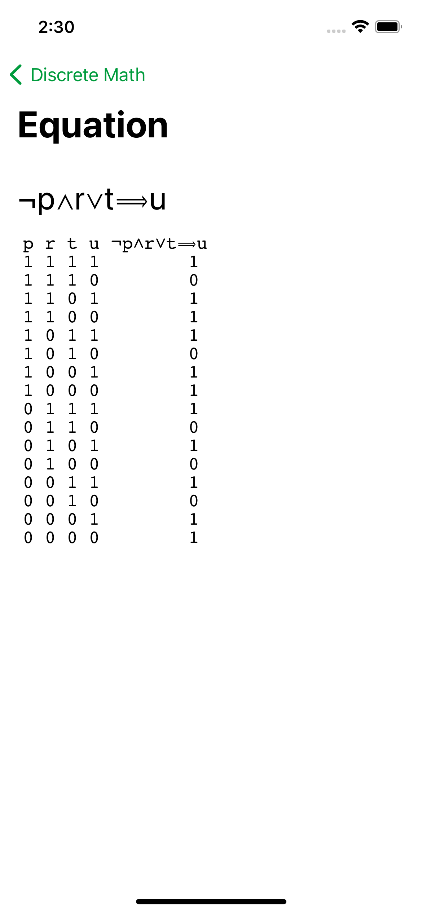

# Truth Table iOS App 

This project was created during the Knight Hacks Hack-a-thon at UCF in March 2019.

The goal of this project is to generate truth tables given a propositional logic formula. This would help reduce manual labor of college students taking classes such as discrete math.

Equations are stored in `UserDefaults`, so they persist even after the application is quit.

 

  

